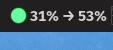

# cc-usage-tray

A Linux tray icon + dashboard for **Claude Code** users that shows live `/usage` percentages, projections to reset, and stale-data warnings.

> **Not affiliated with or endorsed by Anthropic.** This tool reads only data Claude Code already writes to your local disk plus the JSON Anthropic itself feeds to the user-configurable [`statusLine` hook](https://code.claude.com/docs/en/statusline). It does **not** proxy, resell, or otherwise abuse Claude API access.



## Why this exists

Claude Code's `/usage` slash command shows two numbers users care about:

- **5-hour rolling session**: how close you are to your subscription's short-window cap
- **7-day rolling weekly**: how close you are to the weekly cap

Both are critical for avoiding mid-session rate-limit surprises. But:

- The numbers are buried inside a TUI dialog you have to type `/usage` to see
- They reset asynchronously — no obvious schedule
- Anthropic doesn't publish the underlying token budgets, so third-party heuristics drift from reality

This project surfaces those exact numbers (matching `/usage` to the percentage point) in your system tray, with linear projections for both windows and stale-data warnings if the underlying data feed stops updating.

## How it works

Three sanctioned data sources, no internal API access:

```
                     ┌─────────────────────────────────────────────┐
   Claude Code ──┬──▶│ statusLine hook → JSON via stdin            │ ← rate_limits.{five_hour,seven_day}.used_percentage
                 │   │ (documented at code.claude.com/docs/en/statusline)
                 │   └─────────┬───────────────────────────────────┘
                 │             ▼
                 │   ┌─────────────────────────────────────────────┐
                 │   │ statusline-rate-capture.sh                  │ ← writes ~/.claude/usage_monitor/
                 │   │   (your statusLine command, wraps existing) │   rate_limits_cache.json
                 │   └─────────┬───────────────────────────────────┘
                 │             ▼
                 │   ┌─────────────────────────────────────────────┐
   Local JSONL ──┴──▶│ ccusage CLI (npm: ccusage@18+)              │ ← ccusage blocks --active --json
   transcripts       │   reads ~/.claude/projects/*.jsonl          │   (active 5h block: tokens, cost, burn rate)
                     └─────────┬───────────────────────────────────┘
                               ▼
                     ┌─────────────────────────────────────────────┐
                     │ usage_monitor.main (systemd timer, ~5 min)  │
                     │   merges cache + ccusage → readings.jsonl   │
                     │   computes projections, writes status file  │
                     └─────────┬───────────────────────────────────┘
                               ▼
                     ┌─────────────────────────────────────────────┐
                     │ tray (GTK3 AppIndicator) reads status file  │
                     │ every 10s, renders icon + label + menu      │
                     └─────────────────────────────────────────────┘
```

## What you get

**Tray icon** with color-coded disk:
- 🟢 Safe (< 70% week + < 70% session)
- 🟡 Approaching (≥ 70%)
- 🔴 Alert (≥ 90% or projected to exceed)
- ⚪ Stale (data older than 10 min — your active Claude Code session has been idle)

**Tray label** (next to icon):
```
30% → 53%
```
Current week % → projected week % at reset.

**Click menu**:
```
Week (all models):        30%
Sonnet week:              —
Session (5h):             13%  →  31%   ends 20:00
Projected at reset:       53%  @ Tue 15:00
Rate:                     +0.52%/h
✓ Safe
Last fresh data:          17:21 (5m ago)
─────────────────────────
Open dashboard
Refresh now
Open status file
─────────────────────────
Quit tray
```

**HTML dashboard** (one click from menu): two SVG charts — weekly across the 7-day window, 5-hour block — both with anchored projection, alert thresholds at 90%/100%, "now" marker.

**Optional ntfy push notifications** when projection or current % crosses 90%, plus a desktop notification via `notify-send`.

## Compatibility

The tray uses [AyatanaAppIndicator3](https://ayatanaindicators.github.io/), the
maintained successor to the legacy AppIndicator. Library packaging and tray
support varies by desktop:

| Desktop | Tray icon shows? |
|---|---|
| **KDE Plasma** | ✅ Native (StatusNotifierItem) |
| **Cinnamon / MATE / Budgie / Xfce / LXQt** | ✅ Native |
| **Pop!_OS / Ubuntu** (GNOME-based but ship the extension by default) | ✅ |
| **GNOME (stock, since 3.26 / Sep 2017)** | ⚠️ Requires the [AppIndicator and KStatusNotifierItem Support](https://extensions.gnome.org/extension/615/appindicator-support/) extension. Install: `sudo apt install gnome-shell-extension-appindicator` (Debian/Ubuntu) or `sudo dnf install gnome-shell-extension-appindicator` (Fedora), then enable in GNOME Extensions and log out/in |
| **Wayland sessions** | ✅ Same behavior as X11 (Ayatana uses StatusNotifierItem, not X11-specific code) |

### Library package by distro

The Python `gi` binding for AyatanaAppIndicator3 needs the typelib. Install the
appropriate package for your distro:

| Distro | Package |
|---|---|
| Debian / Ubuntu / Mint / Pop!_OS / Kali | `gir1.2-ayatanaappindicator3-0.1` |
| Fedora / RHEL / CentOS Stream | `libayatana-appindicator-gtk3` |
| Arch / Manjaro / EndeavourOS | `libayatana-appindicator` (`extra` repo) |
| openSUSE | `typelib-1_0-AyatanaAppIndicator3-0_1` |
| NixOS | `libayatana-appindicator` |
| Void / Alpine / musl-based | varies; you may need to build from source |

If you're on stock GNOME and don't want to install the extension, the
`usage_monitor` daemon still produces `~/.claude/usage_status.txt` and the HTML
dashboard — you just lose the tray icon and would need to glance at the file
or open the dashboard manually.

## Requirements

- Linux with systemd `--user` services (tested on Pop!_OS 22.04, GNOME)
- Python 3.10+
- GTK 3 + AyatanaAppIndicator3 typelibs:
  ```
  sudo apt install python3-gi gir1.2-ayatanaappindicator3-0.1 python3-cairo
  ```
- Node.js 20+ for the `ccusage` CLI
- An active Claude Code subscription (Pro / Max). API-key-only users won't have a `/usage` to surface.
- `jq` (for the statusLine wrapper)

## Setup

### 1. Install ccusage (pinned)

```bash
npm install -g ccusage@18.0.11
```

> Why pinned? See [Verify before install](#supply-chain-safety).

### 2. Clone & install

```bash
git clone https://github.com/<your-username>/cc-usage-tray.git
cd cc-usage-tray
pip install --user -e .   # or just put usage_monitor/ on PYTHONPATH
```

### 3. Wire up the statusLine wrapper

Copy the wrapper to `~/.claude/`:

```bash
cp hooks/statusline-rate-capture.sh ~/.claude/
chmod +x ~/.claude/statusline-rate-capture.sh
```

If you already have a `statusLine` command configured in `~/.claude/settings.json`, the wrapper will delegate to it. Set it up:

```jsonc
// ~/.claude/settings.json
{
  "statusLine": {
    "type": "command",
    "command": "bash ~/.claude/statusline-rate-capture.sh"
  }
}
```

You can keep your existing prompt logic — put it in `~/.claude/statusline-command.sh` and the wrapper will pipe through to it. Or leave that file absent and the wrapper just captures rate_limits silently.

### 4. Install systemd units

```bash
mkdir -p ~/.config/systemd/user
cp systemd/* ~/.config/systemd/user/
systemctl --user daemon-reload
systemctl --user enable --now cc-usage-monitor.timer
systemctl --user enable --now cc-usage-tray.service
```

### 5. (Optional) ntfy push notifications

To get phone push notifications when usage crosses thresholds, set in your shell profile:

```bash
export CLAUDE_USAGE_NTFY_URL="https://ntfy.sh"
export CLAUDE_USAGE_NTFY_TOPIC="your-private-secret-topic-string"
```

Or self-hosted:

```bash
export CLAUDE_USAGE_NTFY_URL="https://ntfy.your-domain.example"
export CLAUDE_USAGE_NTFY_TOPIC="claude-usage"
```

Then install the [ntfy app](https://ntfy.sh/) on your phone and subscribe to the same topic. **Use a long, unguessable topic string** — there's no auth on ntfy.sh public; anyone who knows the topic name can subscribe.

If both env vars are unset, only local desktop notifications fire.

## Configuration

| Env var | Default | Purpose |
|---|---|---|
| `CLAUDE_USAGE_NTFY_URL` | unset (no push) | ntfy server base URL |
| `CLAUDE_USAGE_NTFY_TOPIC` | unset (no push) | ntfy topic name |
| `CCUSAGE_BINARY` | `ccusage` (PATH lookup) | Path to ccusage if not on PATH |

The default scrape cadence is 5 minutes; edit `systemd/cc-usage-monitor.timer` `OnUnitActiveSec=` to change.

## How accurate is this?

Session % and week % match `/usage` to the percentage point — they're literally the same numbers Claude Code itself displays, captured from the JSON Anthropic feeds to your statusLine hook.

Projection (`→ NN%`) uses an anchored linear rate (current_pct ÷ hours_elapsed_in_window) projected to the reset time. It's pessimistic-stable: it doesn't panic from short bursts (we measured a 38-minute +2% burst projecting to 324% before fixing this), but it does flag sustained high burn early.

## Limitations

- **Stale data when no Claude Code session is open**: the rate_limits cache only updates while a Claude Code TUI is running. If you close all Claude windows and stay closed for >10 min, the tray shows ⚠ stale.
- **No per-model breakdown**: only "all models" weekly is exposed by Anthropic. Sonnet-only is not in the statusLine JSON (you'd need the deprecated tmux probe to get it; we dropped that in this version).
- **Linux/GTK only**: AyatanaAppIndicator is GTK3. Mac/Windows not supported.

## Supply-chain safety

This project's only runtime npm dependency is `ccusage` (0 transitive dependencies, [13.3k stars](https://github.com/ryoppippi/ccusage), MIT). The pinned version is `18.0.11`. Audit before bumping.

## License

MIT — see [LICENSE](LICENSE).

## Acknowledgments

- [ccusage](https://github.com/ryoppippi/ccusage) (@ryoppippi) — the JSONL parser this project depends on
- [Claude-Code-Usage-Monitor](https://github.com/Maciek-roboblog/Claude-Code-Usage-Monitor) (@Maciek-roboblog) — different approach, same problem space
- The Claude Code team at Anthropic for documenting the [statusLine hook schema](https://code.claude.com/docs/en/statusline) — without that, this tool would be much hackier
